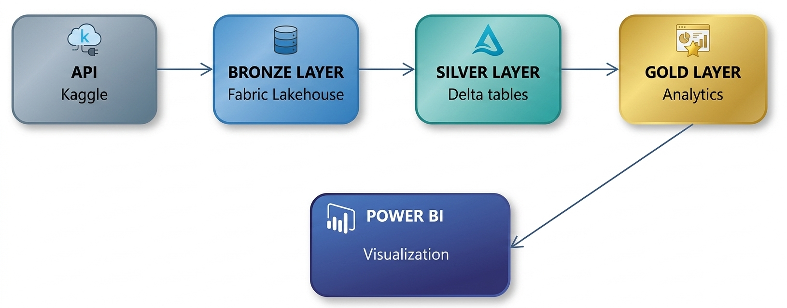

<h1 style="font-size: 18pt;">🏥 Fabric-Healthcare-Analytics</h1>
> **End-to-end Data Engineering solution leveraging the Microsoft Fabric ecosystem to transform raw clinical data into actionable insights.**

---

## 🌟 Project Overview

This project demonstrates a production-grade data engineering lifecycle within the **Microsoft Fabric** environment. By applying the **Medallion Architecture**, I have engineered a pipeline that takes fragmented, simulated patient records and refines them into high-fidelity datasets for predictive analytics and facility reporting.

The primary focus is on **scalability**, **data integrity**, and **real-time accessibility**—critical factors in modern healthcare IT infrastructure.

---

## 🛠 Tech Stack & Tools

📊 **Microsoft Fabric** · 🔥 **Apache Spark** · 🐍 **Python** · 🗄️ **SQL** · ☁️ **Azure**

---

## 🏗 Medallion Architecture Plan

To ensure a robust system, the data flows through three distinct layers within **OneLake**:

| Layer | Status | Process |
|------|--------|---------|
| 🟫 **Bronze** | **Raw** | Ingestion of simulated JSON/CSV health records in their native format. |
| 🥈 **Silver** | **Validated** | Schema enforcement, deduplication, and PII (Personal Identifiable Information) masking using Spark. |
| 🥇 **Gold** | **Curated** | Business-level aggregates, such as *Patient Readmission Risk* and *Resource Utilization* metrics. |

---

## 🚀 Key Engineering Features

* **Orchestration:** Automated data movement using **Fabric Data Factory** pipelines.
* **Transformation:** High-performance data cleaning using **PySpark Notebooks**.
* **Storage:** Unified data storage in **Delta Lake** format for ACID compliance.
* **Intelligence:** Seamless integration with **Power BI** for real-time clinical dashboards.

---

## 📂 Project Structure

├── 01-ingestion-bronze/   # Fabric Notebooks for data landing
├── 02-refinement-silver/  # Cleaning & validation logic
├── 03-analytics-gold/     # Aggregation & Gold layer views
├── data/                  # Sample synthetic datasets
└── docs/                  # Architecture diagrams and documentation

---

## 🛠️ Data Platform Architecture

This project implements a clinical data platform using the standardized **Medallion Architecture**. This design ensures clear separation of concerns, data reliability, and high-performance analytics.

Here is the visual representation of the platform’s data flow within Microsoft Fabric:

### Architecture Deep Dive

1.  **Ingestion:** Raw patient records landed in the **Bronze Layer**.
2.  **Refinement:** PySpark used to perform schema enforcement, handle null values, and apply **SHA-256 hashing** for robust PII masking in the **Silver Layer**.
3.  **Aggregation:** Data curated into business-ready dimensions and facts in the **Gold Layer** for optimized querying.
4.  **Visualization:** Data visualized in **Power BI** using **Direct Lake** mode for real-time reporting.